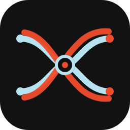

# AxonWeave

<div align="center">
  
  <p><strong>AxonWeave</strong> · v0.1.0</p>
  <p><em>A woven neural axon mark — two interlaced strands crossing a central soma node.</em></p>
</div>

AxonWeave is an open-source Python library for using the **Drosophila Male CNS v1.0 connectome** as a reusable, trainable biological neural substrate and as a composable layer inside conventional machine-learning models.

It is designed around one separation: **the published biological substrate is source data; the computational model is an explicit, configurable interpretation of that substrate.** AxonWeave therefore does not claim that a connectome by itself is a complete biophysical simulation.

## What it provides

- One-command provisioning of the official MaleCNS v1.0 substrate.
- Sparse connectome representation using NumPy/SciPy.
- Native PyTorch `nn.Module` integration.
- Native TensorFlow/Keras `Layer` integration.
- NumPy/SciPy reference execution.
- Explicit neurotransmitter/receptor/sign policies instead of hidden biological assumptions.
- Trainable edge parameters while preserving the source topology.
- Optional trainable global gain and bias.
- A backend/device policy that delegates execution to the host framework.
- Rust/PyO3 extension points for performance-critical kernels.
- Checkpoint metadata designed to preserve substrate identity and model assumptions.
- Interoperability targets for `neuprint-python` and `navis`.

## Install

Current release: **v0.1.0** (see [`axonweave.__version__`](python/axonweave/__init__.py) — the single source of truth mirrored into wheel metadata, `CITATION.cff`, and the docs-site version menu).

The Python package stays small. Multi-gigabyte biological source files are **not** embedded in the PyPI wheel.

```bash
pip install axonweave
axonweave substrate install male-cns:v1.0
```

Framework extras:

```bash
pip install 'axonweave[torch]'
pip install 'axonweave[tensorflow]'
pip install 'axonweave[all]'
```

The installer downloads the official MaleCNS files, validates release identity and source metadata, builds the sparse substrate, and stores it under the AxonWeave cache. Users do not need to manually manage Feather files.

## First model

```python
import torch
import torch.nn as nn
import axonweave

brain = axonweave.load("male-cns:v1.0")

model = nn.Sequential(
    nn.Linear(256, brain.n_neurons),
    brain.torch_layer(trainable_edges=True),
    nn.GELU(),
    nn.Linear(brain.n_neurons, 10),
)

x = torch.randn(8, 256)
# The example is illustrative: the first Linear must map to brain.n_neurons.
```

For a production model, use a deliberate input projection/readout strategy and account for the very large state dimension of the full connectome.

## Composability

AxonWeave does not restrict the surrounding architecture to Dense/CNN layers. Any layer that the host framework can compose may surround or interleave with an AxonWeave layer: attention, convolution, recurrent/state-space layers, normalization, custom research modules, adapters, readouts, and user-defined layers.

## Biology and scientific constraints

MaleCNS v1.0 supplies structural connectivity and published biological metadata, including aggregate neurotransmitter predictions. It does not uniquely determine receptor dynamics, membrane dynamics, plasticity, all synaptic delays, or a complete neuron-by-neuron biophysical simulator.

AxonWeave therefore requires those assumptions to be explicit. A neurotransmitter prediction is not silently converted into a universal excitatory/inhibitory rule. Users provide a receptor/sign policy and may choose their own dynamics and delay models.

## Devices

AxonWeave delegates device execution to the installed backend. PyTorch users use PyTorch devices such as CPU, CUDA, MPS, XPU, and other supported devices. TensorFlow/Keras users use TensorFlow's device/runtime support, including CPU, GPU and TPU where the relevant sparse operations are supported.

There is no honest way for a Python package to guarantee every backend's sparse kernel on every accelerator. AxonWeave therefore performs capability checks and fails explicitly rather than silently moving tensors to CPU.

## Substrate distribution

The complete MaleCNS release is too large for a normal PyPI wheel. The runtime package and biological substrate are distributed separately.

```text
PyPI wheel
  ├── Python API
  ├── Rust/PyO3 extension
  ├── backend adapters
  ├── installer + schemas
  └── docs metadata

MaleCNS substrate artifact
  ├── official source files
  ├── sparse graph
  ├── metadata
  └── provenance manifest
```

This supports online provisioning, offline/enterprise caches, reproducible substrate builds, and future additional connectomes.

## Scientific provenance

The default substrate is the official **MaleCNS v1.0** release from Janelia/FlyEM. The project documentation records the exact source URLs and licensing information. The Male CNS data are CC-BY; AxonWeave software is Apache-2.0.

See:

- `DATA_SOURCES.md`
- `DATA_LICENSE.md`
- `docs-site/` for the live documentation application

## Development

```bash
git clone <repository>
cd axonweave
python -m pip install -e '.[dev]'
pytest -q
```

Rust extension development:

```bash
maturin develop --release
cargo test --manifest-path rust/Cargo.toml
```

Documentation:

```bash
cd docs-site
npm install
npm run dev
```

## Project status

This repository is a production-oriented foundation, not a claim of a completed biological simulator. The structural graph path, provisioning architecture, PyTorch/Keras/NumPy adapters, Rust boundary, documentation application, CI/CD, and governance scaffolding are included. Full neuron-type dynamics, receptor models, synapse-level delays/plasticity, distributed partitioning, and accelerator-specific benchmark certification remain explicit roadmap items.

## License

Software: Apache-2.0. Biological data: CC-BY under the upstream MaleCNS terms. Do not redistribute upstream data under the software license.
